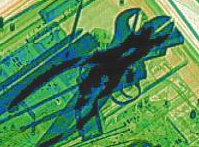

# README
## 关于
此项目意在使用 CNN 进行物体识别，数据集为危险物品的 X 光透射照片，如 🔫，✂️，🔧，🔪 等。如下所示
<center class="half">

</center>


##进度 & 食用方法
目前已经使用 torch 自带的 ResNet34 和 AlexNet 训练出了两个模型（chkpoint.bin），效果拔群。

运行 train.py 可以开始训练，若不提供 chkpoint.bin（不继续训练）则需要注释掉第 88 行。环境和依赖啥的自己解决咯。

数据集放在 ./data 下面，目录结构如下

```
./data
├── eval
│   ├── 0
│   │   ├── 0.1007.jpg
│   │   ├── 0.1008.jpg
│   │   ├── 0.1016.jpg
│   │   ├── 0.1017.jpg
│   │   ├── 0.1024.jpg
│   │   ├── 0.1025.jpg
│   ├── 1
│   │   ├── 1.1001.jpg
│   │   ├── 1.1002.jpg
│   │   ├── 1.1011.jpg
│   │   ├── 1.1012.jpg
│   ├── 2
│   │   ├── 2.1001.jpg
│   │   ├── 2.1002.jpg
│   │   ├── 2.1011.jpg
│   │   ├── 2.1012.jpg
...


```

## TODO
* [x] 基本可用的训练脚本，包括数据集对象（继承自 ImageFolder 类），数据集加载器对象（继承自 dataloader），简单的数据集增强（Transform，包含 padding 为正方形，随机旋转等），使用 SGD 和 交叉熵，以及一个装逼的进度条。
* [ ] 设计一个友好的验证脚本（eval.py），从命令行中传入测试一个图片，并通过网络预测其标签。
* [ ] 改进训练脚本，设计命令行参数，分离出 config.py（超参数设置），和 network.py (网络定义部分)
* [ ] 改进数据增强，提高模型的正确率。
* [ ] 自己设计一个网络并训练它，并希望上帝能让它收敛，还能有一个不错的正确率。
